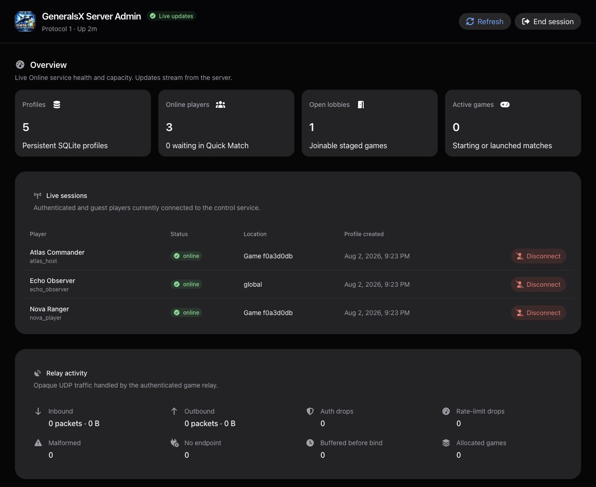
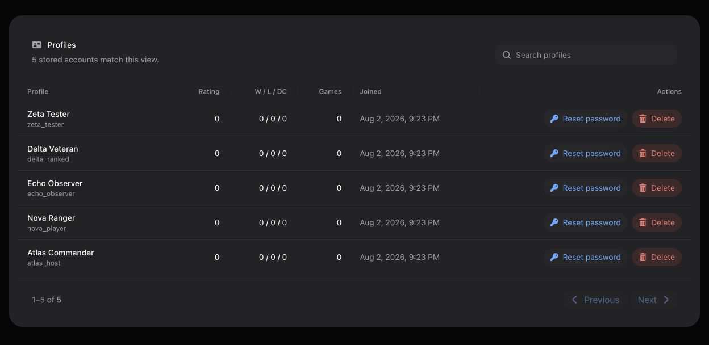

# GeneralsX Online Server

`generals-server` is the standalone Go service behind the GeneralsX
**MULTIPLAYER > ONLINE** path. It provides account and lobby control over TCP,
plus an authenticated UDP relay for game traffic. LAN discovery and local play
remain independent of this service.

This README is the shortest path from a fresh checkout to a usable server. For
the complete wire contract and production details, see:

- [Online protocol](docs/PROTOCOL.md)
- [Operations and security guide](docs/OPERATIONS.md)

## What the server provides

- guest sessions, persistent registration and login, resumable sessions, and
  profiles;
- public rooms, direct chat, buddies, presence, custom games, and basic
  two-player Quick Match;
- cross-platform compatibility partitioning for Generals and Zero Hour;
- a slot-aware UDP relay for opaque retail game traffic;
- transactional SQLite profile, relationship, and statistics storage;
- JSON health/readiness endpoints and Prometheus metrics;
- a public read-only website for service status, leaderboards, online players,
  open lobbies, and active games;
- a private bearer-authenticated admin dashboard with live WebSocket updates,
  session and lobby controls, profile search, password reset, and profile
  deletion.

## Admin dashboard demo



*The private dashboard streams service health, live sessions, lobbies, and
relay activity in near real time.*



*Operators can search stored profiles and use guarded password-reset or
permanent-delete actions.*

The screenshots use synthetic local profiles. No production account, address,
or credential is shown.

## Prerequisites

For local development:

- Go 1.26 or newer.

For the supplied production deployment:

- Docker Engine with Docker Compose v2;
- a player-resolvable DNS name or public IPv4 address;
- a TLS certificate and private key for the control listener;
- inbound TCP `29900`, UDP `27901`, and public web TCP `8082` forwarded to the
  same host;
- Tailscale, or an equivalent private management network, for the admin UI.

## Local quick start

Run a guest-only server with every listener restricted to loopback:

```bash
go run ./cmd/generals-server \
  --control-listen 127.0.0.1:29900 \
  --relay-listen 127.0.0.1:27901 \
  --health-listen 127.0.0.1:8080 \
  --public-web-listen 127.0.0.1:8082 \
  --public-host 127.0.0.1
```

Check readiness:

```bash
curl -fsS http://127.0.0.1:8080/readyz
curl -fsS http://127.0.0.1:8082/api/public/v1/snapshot
```

Start the game with this endpoint (`--onlineServer` is also accepted):

```text
-onlineServer 127.0.0.1:29900
```

A bare endpoint uses plaintext guest authentication and never sends a retail
password. Persistent registration and login require verified TLS. For a
strictly local test only, `--allow-insecure-password-auth` enables password
authentication on plaintext TCP; never use that flag on an Internet-facing
listener.

The default SQLite database is `data/profiles.db`. Override it with
`--data-file` when you want disposable or isolated development data.

## Production setup with Docker Compose

The supplied [Compose file](compose.yaml) is the recommended deployment. It
publishes gameplay ports publicly, binds health/metrics to host loopback, and
binds the admin service only to one exact private IPv4 address. The read-only
public website is published separately on TCP `8082`.

For a cost-conscious AWS installation, the
[Terraform deployment](deployments/aws/README.md) provisions one containerized
EC2 host with an Elastic IP, retained encrypted EBS storage, Route 53 DNS,
DNS-validated ACME TLS, and SSM-only administration. It deliberately omits a
load balancer, NAT Gateway, multi-AZ replicas, and application backups.

### 1. Create private host paths

From the repository root:

```bash
install -d -m 0700 "$HOME/generals-data" "$PWD/tls"
umask 077
openssl rand -base64 48 > "$PWD/admin-token"
cp .env.example .env
```

The admin token must be a regular file containing 32–4096 printable ASCII
bytes, with no group or other permissions. Never commit `.env`, certificates,
the token, or runtime data.

### 2. Configure `.env`

Collect the host values used by Compose:

```bash
id -u
id -g
tailscale ip -4
```

Edit `.env` and replace every example value:

| Variable | Purpose |
|---|---|
| `GENERALS_PUBLIC_HOST` | Bare player-resolvable DNS name or IPv4 address; no scheme or port |
| `GENERALS_DATA_DIR` | Existing absolute private directory for `profiles.db` and WAL sidecars |
| `GENERALS_TLS_DIR` | Existing absolute directory containing `fullchain.pem` and `privkey.pem` |
| `GENERALS_ADMIN_HOST` | Exact Tailscale/private IPv4 address; never `0.0.0.0` |
| `GENERALS_ADMIN_TOKEN_FILE` | Existing absolute path to the mode-`0600` token file |
| `GENERALS_UID` / `GENERALS_GID` | Numeric owner IDs for the bind-mounted files |
| `GENERALS_IMAGE` | Image name; defaults to `generals-server:local` |
| `GENERALS_BUILD_CONTEXT` | Docker build context; defaults to `.` |

`GENERALS_CERTIFICATE_NAME`, `GENERALS_ACME_VOLUME`, and
`GENERALS_CERTBOT_IMAGE` are used only by the optional Certbot renewal helper.

### 3. Install the TLS files

Copy an existing certificate chain and matching private key into the configured
TLS directory:

```bash
install -m 0600 /secure/source/fullchain.pem "$PWD/tls/fullchain.pem"
install -m 0600 /secure/source/privkey.pem "$PWD/tls/privkey.pem"
```

Both files are required. The server accepts TLS 1.2 or newer, and the
certificate name must match the hostname players use. The operations guide
also documents the optional
[Certbot issuance and renewal flow](docs/OPERATIONS.md#container-deployment).

### 4. Validate and start

```bash
docker compose config --quiet
docker compose up --build -d
docker compose ps
curl -fsS http://127.0.0.1:8080/readyz
curl -fsS http://127.0.0.1:8082/api/public/v1/snapshot
```

Follow logs with:

```bash
docker compose logs -f
```

## Network and firewall layout

| Listener | Exposure | Purpose |
|---|---|---|
| TCP `29900` | Public | TLS control, authentication, chat, and matchmaking |
| UDP `27901` | Public | Authenticated game-packet relay |
| TCP `8080` | Loopback or private monitoring only | Health, readiness, and Prometheus metrics |
| TCP `8081` | Exact Tailscale/private address only | Admin REST API, dashboard, and WebSocket stream |
| TCP `8082` | Public | Read-only website and public snapshot API |

If NAT maps a different external UDP port to local UDP `27901`, set that
external port with `--public-relay-port`. Do not publish TCP `8080` or `8081`
on the public firewall.

## Browse the public website

Open the read-only public interface at:

```text
http://online.example.net:8082/
```

TCP `8082` is a plaintext origin HTTP listener. For an Internet-facing website,
terminate HTTPS on a reverse proxy (normally TCP `443`) and forward only the
public origin traffic to TCP `8082`; do not route admin TCP `8081` through that
public proxy. The direct `:8082` URL is appropriate for local access and origin
smoke tests.

It presents service status, the leaderboard, online players, joinable lobbies,
and active games from the same process that owns the live Online state. Its only
JSON endpoint is `GET /api/public/v1/snapshot`; all returned collections are
bounded and contain public display data rather than account usernames or admin
controls.

The public listener is disabled unless `--public-web-listen` is set. It runs on
an independent HTTP server and route table: `/admin/` and every
`/api/admin/v1/*` path are unavailable on TCP `8082`, even when a request sends
an admin bearer token. Keep TCP `8081` on the private management network.

## Connect players

Production players use a verified TLS endpoint:

```text
-onlineServer tls://online.example.net:29900
```

`--public-host` must be the bare DNS name or IPv4 address advertised to relay
clients. It cannot contain a scheme, port, path, whitespace, or IPv6 literal.
The server rejects invalid values at startup.

The game client handles registration, login, rooms, lobbies, Quick Match, and
relay negotiation through its normal Online menus. The server deliberately
partitions games by product, compatibility version, and gameplay INI CRC so
compatible Windows and macOS builds can meet without comparing platform-native
executable hashes.

## Use the admin dashboard

From a device on the same private network, open:

```text
http://<tailscale-name-or-ip>:8081/admin/
```

Paste the token stored at `GENERALS_ADMIN_TOKEN_FILE`. The browser retains it
only in the current tab's `sessionStorage`. The dashboard exchanges the token
for a 30-second, single-use WebSocket ticket and receives server snapshots
approximately once per second; periodic REST refreshes remain available if the
stream disconnects.

Operators can:

- inspect capacity, live sessions, relay counters, and staged/active games;
- disconnect a player or close a lobby;
- search paginated persistent profiles;
- reset a password (8–128 bytes) or permanently delete a profile through
  confirmation dialogs.

Resetting or deleting a profile revokes saved resume credentials, pending
admissions, and any active connection for that account. Profile deletion also
removes its buddy relationships and pending requests.

The admin listener is disabled unless both `--admin-listen` and
`--admin-token-file` are set. For a raw-binary deployment, bind it to one exact
private address:

```bash
--admin-listen 100.64.0.1:8081 \
--admin-token-file /etc/generals-server/admin-token
```

## Monitor and operate

The private operations listener exposes:

| Endpoint | Use |
|---|---|
| `GET /healthz` | Process and listener health |
| `GET /readyz` | Deployment readiness |
| `GET /metrics` | Prometheus metrics |

Routine Compose commands:

```bash
docker compose up -d
docker compose logs -f
docker compose restart
docker compose down
```

After a source update:

```bash
docker compose build --pull
docker compose up -d
docker compose ps
curl -fsS http://127.0.0.1:8080/readyz
curl -fsS http://127.0.0.1:8082/api/public/v1/snapshot
```

Schedule restarts outside active matches. Profiles and stats remain in SQLite,
but sessions, rooms, lobbies, Quick Match queues, guest profiles, and relay
allocations are process-local and do not survive a restart.

SQLite uses write-ahead logging. Never copy only `profiles.db` while the server
is running: committed data may still be in `profiles.db-wal`. Stop the service
and copy the complete data directory, take a consistent filesystem snapshot,
or use a SQLite-aware backup mechanism. The detailed
[backup and restore guidance](docs/OPERATIONS.md#persistence-and-backups) also
covers ownership and restore testing.

## Run a standalone binary

Compose is preferred, but the server also builds as a CGO-free binary:

```bash
CGO_ENABLED=0 go build -trimpath \
  -o bin/generals-server ./cmd/generals-server

./bin/generals-server \
  --control-listen :29900 \
  --relay-listen :27901 \
  --health-listen 127.0.0.1:8080 \
  --public-web-listen :8082 \
  --public-host online.example.net \
  --tls-cert /etc/generals-server/tls/fullchain.pem \
  --tls-key /etc/generals-server/tls/privkey.pem \
  --data-file /var/lib/generals-server/profiles.db
```

The supplied [systemd unit](deployments/generals-server.service) and its
installation steps are documented in the
[operations guide](docs/OPERATIONS.md#systemd-deployment). The unit
enables the read-only public site on TCP `8082` and intentionally leaves the
admin service disabled; add both admin flags and a private token file if you
enable it.

## Development and verification

Backend checks:

```bash
go test -race ./...
go vet ./...
CGO_ENABLED=0 go test -count=1 ./...
CGO_ENABLED=0 go build -trimpath -o bin/generals-server ./cmd/generals-server
```

The integration suite exercises real control sockets, authentication, rooms,
game staging, start coordination, and bidirectional UDP relay traffic.

The authored admin and public applications are in `web/`; their checked-in
production output is embedded from `internal/app/adminui/dist` and
`internal/app/publicui/dist` by the Go standard library. To regenerate the
public application after a frontend change:

```bash
cd web
npm ci
npm run typecheck
npm run build:public
```

Use `npm run build:admin` (or the existing `npm run build`) for an admin-only
change, or `npm run build:all` when both applications intentionally need to be
rebuilt.

Normal Go and Docker builds use the checked-in generated assets and do not need
Node or frontend package credentials. Frontend development requires access to
the packages declared in `web/package.json`. Never commit local package caches
or `node_modules`.

## Operational boundaries

- One process is the only supported writer for a database file; SQLite is not
  shared coordination for replicas.
- A staged game supports at most eight participants.
- Relay credentials authenticate routing but do not encrypt game packets.
- Chat and all live coordination state are ephemeral.
- Stats/result submission is compatibility-oriented and currently trusts the
  client.

See [Operations](docs/OPERATIONS.md) for capacity limits, rate limits, relay
buffering, graceful shutdown, firewall hardening, and certificate renewal.
